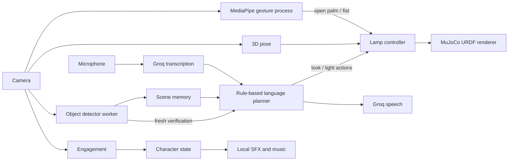

# Technical note

## Architecture and data flow

The main loop owns character state, the latest perception results, and all lamp
commands. Object detection and speech each use a single background worker. A
one-job limit prevents stale frames or voice requests from accumulating. The
internal action protocol is deliberately small: `(look, left|center|right)` and
`(light, on|off)`. `plan_request` decides actions from recognized words plus the
current visible-object map; `perform_actions` is the boundary that executes
those decisions on the body. A goal completes only after detection processes a
camera frame captured after action start.

## Models, simulation, and deployment

RF-DETR Nano supplies COCO object labels. MediaPipe supplies pose landmarks on
CPU. MediaPipe GestureRecognizer supplies open-palm/fist control in a separate
process with one outstanding frame and bounded restart attempts. This contains
native crashes; it does not prove their original cause. OpenCV Haar cascades
provide a lightweight engagement signal:
a face with at least one eye. Groq Whisper Large V3 Turbo transcribes a fixed
three-second recording, and Groq Orpheus generates the short spoken answer.
Only microphone audio and response text leave the laptop. Camera frames remain
local. A deterministic planner was chosen over another cloud language call so
the command vocabulary, grounding, and action limits are easy to explain and
test.

MuJoCo imports the supplied five-DOF URDF and performs forward kinematics. The
controller directly sets bounded simulated joint positions. Within its physical
range, the lower lamp segment matches the human upper arm's angle above the
ground; lower angles stop at the URDF shoulder soft limit. It does not claim to
model motors. For physical hardware, the same action boundary would need a
rate-limited actuator driver, encoder feedback, collision checks, an emergency
stop, and timeout behavior. Ubuntu 24.04 setup uses Python 3, PortAudio, OpenGL,
and the pinned packages in `requirements.txt`. No GPU or CUDA is required.

## Character behavior and measurements

Engagement uses 0.5 seconds of continuous evidence to engage and 1.0 second to
disengage, reducing flicker from a missed face frame. Engagement triggers light
plus a two-note sound effect. Listening has a distinct ping. A grounded goal
triggers motion/light and an eight-note musical success theme. Responses use a
generated character voice. Scene memory stores each object's latest left,
center, or right position and last-seen time.

The time-based arm filter reaches about 92% of a step after 0.2 seconds,
independent of frame rate. Twenty-eight deterministic tests currently pass,
covering 3D arm geometry, joint limits, memory, parsing, and action execution.
During a live run, the terminal reports five-second-window FPS, process CPU
usage, peak resident memory, transcription latency (including the fixed
three-second recording), goal re-observation latency, and speech generation plus
playback latency. Record a representative line here before submission:

CPU and peak RSS printed by the app cover the main process only. Measure the
gesture worker separately when reporting total deployment resource usage.

`FPS: ___ | CPU: ___% | peak RSS: ___ MB | listening: ___ s | goal: ___ s | speaking: ___ s`

Also run ten look-at/look-away trials under demo lighting and record successful
transitions here: `engage: ___/10 | disengage: ___/10`. This manual measurement
is necessary because camera placement and lighting dominate Haar-cascade
reliability; inventing a result from unit tests would be misleading.

## Known limitations and scope

The eye heuristic is not gaze estimation and may fail with glare, profiles, or
poor light. COCO labels are broad, memory is in-process only, and old positions
are not expired. The parser handles short commands containing known detector
labels; it does not resolve pronouns or plan arbitrary tasks. Single-camera 3D
pose can be noisy under occlusion. The lamp compresses the human shoulder range
and cannot reproduce shoulder roll or forearm rotation. Object boxes can trail
because detection is asynchronous. Speech requires network access and a Groq
key. The completed scope favors one coherent, inspectable demonstration over
open-ended dialogue, persistent databases, or a hardware transport.
